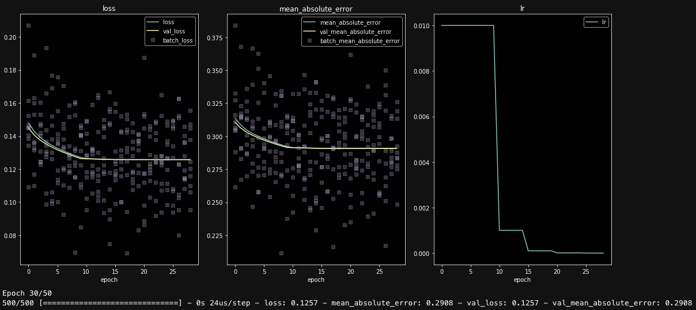

[](https://travis-ci.com/ig248/kerashistoryplot)
[](https://codecov.io/gh/ig248/kerashistoryplot)

# History plot for Keras model training



Plots training losses and metrics in Jupyter while training your `keras` model.

This project started as an attempt to extend [`livelossplot`](https://github.com/stared/livelossplot), but I realized that a rewrite was easier. Key improvements are:

- keeps full history, including losses for each batch in each epoch
- plots scatter of batch losses
- plots arbitrary log entries, such a `lr` (learning rate)
- simplifies codebase extendibility

## Basic Usage
Install package from source:

```
pip install git+https://github.com/ig248/livehistoryplot
```

Import function:

```python
from livehistoryplot.callbacks import PlotHistory
```

Use in callbacks:

```python
model.fit(
    X, y,
    epochs=20,
    callbacks=[
        ReduceLROnPlateau(),
        PlotHistory(batches=True, n_cols=3, figsize=(15, 7))
    ]
)
```

## More Examples
See `notebooks/`

## Tests
Run
```bash
make dev-install
make test
```

## References
Original `livelossplot`: https://github.com/stared/livelossplot
